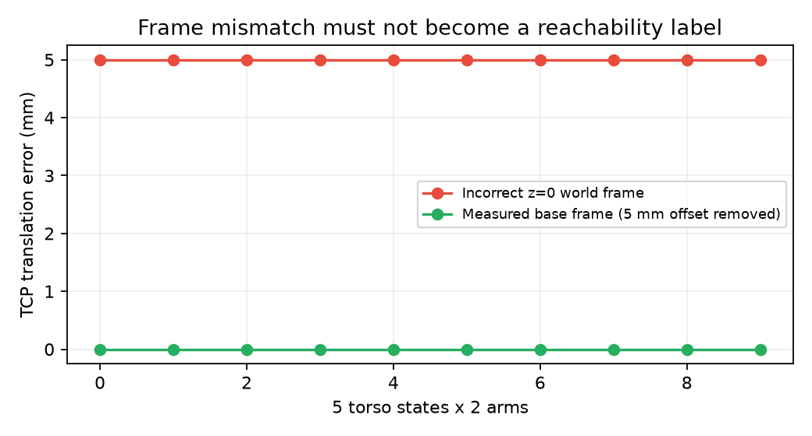
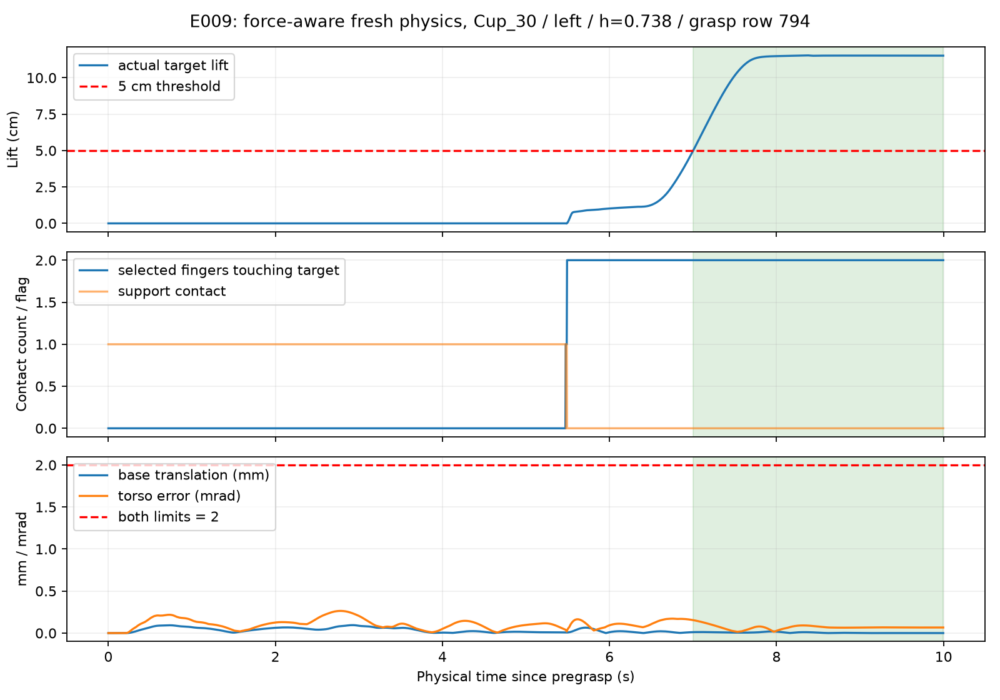
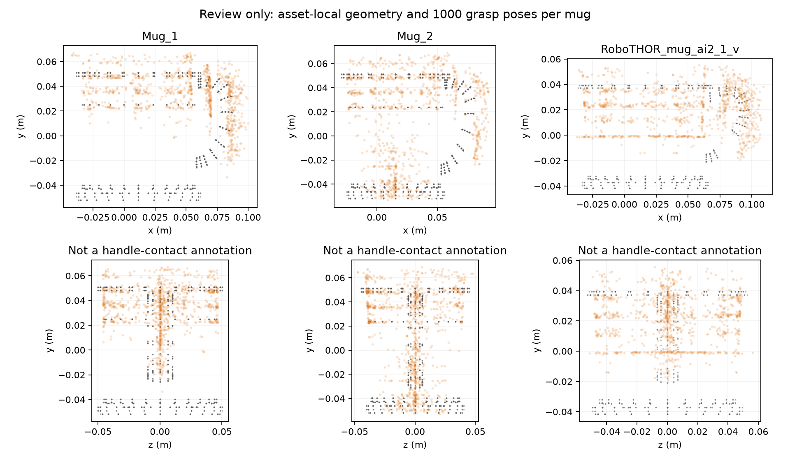

# 阶段 A/B 校准报告

**2026-10-01：阶段 A 已通过当前工程协议下的两正例回归；阶段 B 尚未完成。** 已创建独立工作区，原始代码、benchmark、场景与资产保持不变。杯子与 candle 分别通过 **5/5 次完整恢复后的名义物理复现**。杯子 row 794 又通过同一预注册准入协议下的 **5/5 名义＋20/20 到站扰动**，已写入普通抓法白名单；其余资产和三个把手抓法仍未验收完成。

## 交付与验收边界

| 项目 | 结果与证据 |
|---|---|
| 清晰的独立工作区 | [README](../README.md)：configs、src、scripts、tests、registry、reports、runs |
| 动作和规划协议 | 20 维动作桥；单臂恰好 7 个优化关节；固定底盘、同步真实躯干、保留闲置臂碰撞。[GPU 探针](gpu_planner_probe.json) |
| 模型校准 | 五个 h × 两臂 FK、MJCF/URDF 限位一致。[模型数据](model_calibration.json) |
| 原始正例 14，Cup_30 | 左臂，h=0.738，源 grasp row 794，**5/5**。[力感知复核](E009-cup-force-aware.json) |
| 原始正例 1949，Candle_1 | 右臂，h=0.738，源 grasp row 600，**5/5**。[力感知复核](E010-candle-force-aware.json) |
| 阶段 A 最终判定 | 重新读取原始轨迹检查全程约束，而非采信 success 字段。[判定](stage_a_verdict.json) |
| 阶段 B 普通资产 | Cup_30 / row 794 已准入；替代酒瓶场景 750 双臂各通过一次严格 Pick，重复稳定性待验收；candle、胡椒瓶尚缺资产级扰动证据 |
| 阶段 B 把手资产 | 三份保守区域草案及部件接触执行器已准备；**未人工确认、未物理通过** |
| 正式准入 | 以 [白名单](../registry/whitelist.json) 和 [杯子准入判定](cup_admission.json) 为准；不合并不同协议哈希的试验 |

不开展阶段 C/D，不生成站位图或导航闭环。阶段 A 的名义复现使用冻结控制器、独立完整状态恢复和新物理执行；它不是五次独立随机规划成功率。

## 执行过程：先修桥接，再判断场景

1. 探索方案、RBY1 控制器、cuRobo 和 benchmark，提取完整派生恢复配置及源哈希。当前审计 **10 个候选、7 种资产、7000 个 Droid grasp**。
2. 实现相对关节动作桥、单臂配置、物理轨迹采样、严格 Pick 判定、准入门槛和可复现缓存。
3. 在 CUDA 0/5 做规划和物理复测；保存完整模型、初始快照、躯干调整轨迹、逐物理步控制值与接触证据。
4. 定位并修复接口问题，保留所有旧记录，不把无效运行算进资产成功率或拒绝率。
5. 在统一 5 cm / 2 s、2 mm / 0.2°、1 cm / 5° 等阈值下验证原始正例；没有逐场景放宽阈值、焊接目标、增加摩擦或关闭物理碰撞。
6. 在独立预注册协议下开展资产级复测；把手模式没有确认区域及合规 grasp 集合时，禁止回退到普通抓法。

| 运行 | 发现 | 可支持的结论 |
|---|---|---|
| E001 | 失败规划仍返回起始路点；原始夹爪 actuator 缺位置伺服转换 | 基础设施异常，排除，不用于资产拒绝。[记录](E001-excluded.json) |
| E002 / E003 | AABB 碰撞模型下两正例有限候选池未找到解；其中 candle E002 遇到 CUDA OOM | 不证明物理不可达；OOM 不计失败率 |
| IK 对照 | 杯子仅自碰撞时左臂有解，加入环境 AABB 后无解 | 定位保守几何导致的假阴性；只有 IK，不是抓取成功。[杯子](diagnose_ik_0014.json)、[candle](diagnose_ik_1949.json) |
| E004 | 实际碰撞 mesh 消除部分规划假阴性，但空夹、底盘漂移或躯干偏差仍失败 | 几何修复不等于物理成功。[记录](E004-mesh_positive_0014_seed0.json) |
| E005 / E008 | 固定底盘参考值、保持闲置臂目标、慢速轨迹与统一 1 cm approach overshoot 后出现严格 Pick | 定位控制桥问题；旧距离接触采样不直接准入 |
| E009 / E010 | 力感知采样，完整恢复后分别 5/5 成功 | 当前冻结控制器的两正例名义回归通过 |
| E012 / E013 | 同一预注册 grasp 选择协议，5 次名义执行＋20 次到站扰动 | 完整轨迹复核结果 5/5＋20/20；杯子普通抓法已准入 |

**用户允许换场景。** 已把更近、更高的酒瓶 source_index 750 加入备用候选；它的支撑物是 CounterTop，不能伪称餐桌。原始两个正例现已复现，因此暂不替换，也不把过去的预算无解改写成“已知不可达”。酒瓶 1915/1916 实际恢复发现缺 newspaper；源场景已不满足完整恢复要求，记为基础设施异常而非抓取失败，改测预检查通过的 750。Mug_1 原候选 4 也缺 lettuce，需换兼容场景后再做把手验收。[恢复预检查](restoration_preflight.json)、[酒瓶排除记录](E011-wine-excluded.json)。不跳过缺失对象，不属于阶段 C 站位搜索。

## 坐标与真实动力学证据

错误使用 z=0 的底盘系会引入约 **5 mm** TCP 偏差。改用仿真中真实底盘位姿后，十个静态 FK 对照的最大平移残差约 **0.00048 mm**、旋转残差约 **1.84×10⁻⁷ rad**。这不是完整工作空间或碰撞模型一致性证明。

图 1：五个 h × 两臂确定性 FK 对照。无随机误差棒。[数据](model_calibration.json)、[脚本](../scripts/plot_model_calibration.py)。h 是角参数，增大 h 会降低肩部，不是线性升高量；[肩高图](figures/torso_fk.png) 提供离散状态对照。

图 2：E009 第一次独立力感知重执行。实际目标最终抬升 **11.5 cm**，最后连续双指承力、无支撑且超过 5 cm 的窗口约 **2.99 s**。底盘最大平移约 **0.095 mm**，最大 yaw 约 **0.0055°**，躯干命令最大误差约 **0.264 mrad**，禁止碰撞样本为 **0**。绿色区间是持有诊断窗口；完整成功仍由含相对滑移检查的判定器给出。[数据](cup_trace_metrics.json)、[脚本](../scripts/plot_pick_trace.py)。

接触采样 `force-aware-v2` 检查实际法向接触力。MuJoCo 正距离软接触也可能承力，不能漏记为“无支撑”；负距离也不能自动当成双指承力。旧 E005/E006/E007/E008 记录保留作诊断或冻结控制序列来源，不能单独用于白名单。当前判定器拒绝缺接触力或旧版采样的轨迹。

## 资产审计与把手校准缺口

| 资产 | 源索引 | 元数据支撑物 | 当前限制 |
|---|---|---|---|
| Candle_1 | 1949 | TVStand | 名义正例通过；资产级扰动稳定性未完成 |
| Cup_30 | 14 | DiningTable | 普通抓法 5/5＋20/20 准入；不能称作把手抓法 |
| Wine_Bottle_1 | 1915、1916、1329；备用 750 | DiningTable；750 为 CounterTop | 1915/1916 源场景缺恢复对象；750 双臂单次严格 Pick 通过，重复验收待完成 |
| Pepper_Shaker_1 | 118 | DiningTable | 尚未完成物理资产校准 |
| Mug_1 | 4 | DiningTable | 待把手区域与合规 grasp 确认 |
| Mug_2 | 26 | Dresser | 同上；不是餐桌来源 |
| RoboTHOR_mug_ai2_1_v | 9 | Dresser | 同上；不能靠家具名字认定可绕行 |

每种资产各有 1000 个 Droid grasp，文件只有 `transforms`，没有夹爪宽度、部件标签或稳定性分数。float16 旋转按 2×10⁻³ 容差静态检查，执行时确定性投影到 SO(3)，保留原 row ID。合法变换不等于 RBY1 适配。原始单资产质量与碰撞属性见 [物理属性审计](asset_physical_properties.json)；场景中的实际碰撞分解可能不同，运行时接触是验收依据。

图 3：局部 mesh 顶点与原始 grasp TCP，不是实际手指接触。三个 [部件草案](../configs/parts) 使用保守外侧 +x 区域、杯身禁区与局部 +y 杯口轴；`human_confirmed=false`，正式 `allowed_grasp_ids=[]`。TCP 在区域内的候选只作审阅提示，**不能入白名单**。

把手执行器已接入实际接触点到物体局部坐标的分类，禁区/未知区失败关闭，双指把手承力、杯身/杯沿禁接触、直立及抓前推转监测。没有确认区域和合规 grasp 时直接拒绝运行。这部分尚无真实把手成功证据，不能称阶段 B 完成。

## 下一步与准入规则

- 杯子 20 次预注册扰动已全部成功：世界系 dx、dy 各 ±1 cm，yaw ±2°，固定随机种子序列、单个 row 794、不回退；每次重新规划并真实执行。准入范围仅为该抓法、该站位附近的已测试误差分布，不外推至其他场景或导航。
- 名义必须 5/5，扰动至少 19/20。未执行不进入分母；内部 grasp 搜索不当独立重复；不据工程门槛宣称真实成功率已统计证明大于 95%。
- 完成酒瓶/调料瓶/candle 的资产级稳定性验收。确认三种 mug 的部件区域后再做纯把手物理验收；不稳定则拒绝或换资产，不强行过关。
- 没有稳定把手抓法，不进入 Case 2 站位图；没有导航闭环证据，不称 last-mile case 完成。

完整物理记录在 runs（不入版本管理）；报告图均有 PNG/SVG、数据及脚本，已打开核查。未安装新依赖、未修改 Git 历史或原始资产。

## 酒瓶替代场景最新结果

酒瓶替代场景 E014 使用 CUDA 0，入口 `scripts/run_calibration.py --index 750 --arms right left --heights .738 --world-geometry mesh --time-dilation .25 --approach-overshoot .01 --run-id E014-wine-replacement`。最新结果：右臂 row 374、左臂 row 670 各通过一次严格物理 Pick；尚未完成 5 次名义与 20 次扰动稳定性验收，未进入白名单。[结果](E014-wine-replacement_positive_0750_seed0.json)。日志 [E014](E014-wine-replacement.log)，输出 `runs/stage_a/E014-wine-replacement/0750_seed0/`。这是有限的双臂资产校准作业，不是无限场景搜索。结果落盘后仍需名义和扰动验收才可加入白名单。
