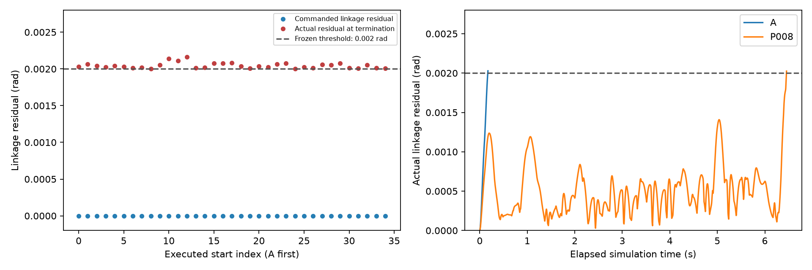
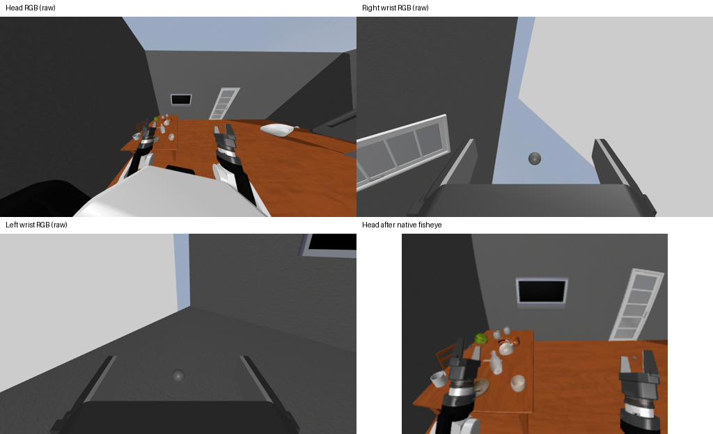

## 躯干提前终止诊断

**35/35 次有效试验因实际躯干联动残差超限提前终止；不是完整40秒抓取尝试后的失败。**

- 命令六关节的联动残差最大值为 **0 rad**，符合 `[0,h,-2h,h,0,0]`。模型并未获得额外躯干自由度。
- 实测残差在末帧超过冻结的 **0.002 rad**；终止时间范围 **0.068–7.344 s**，中位数 **0.980 s**。
- 最大目标抬升为 **0.000000 m**；出现过同一夹爪双指同时真实受力的试验数为 **0**。
- 事实：控制目标符合1D联动，实际全身动态响应违反严格联动阈值。推断：当前全身伺服桥／动力学与严格验收之间的不匹配限制了评测。尚未通过干预确认具体是伺服增益、机械耦合、全身反作用或其他因素。
- 因此，本次结论是“当前桥接与冻结协议下没有严格通过”，不能单独据此声称MolmoBot没有视觉抓杯能力。未修改阈值、夹爪或机器人参数补救。

图：左为每个起点单次试验的命令最大残差与实际终止残差；右为A和P008的4ms原始记录。虚线是固定阈值，无误差棒；不是重复随机试验统计。

图：A点头部、右腕和左腕原始RGB，以及上游鱼眼处理后实际进入模型的头部图像；仅在交付拼图上加标题，不修改模型输入。

[逐点诊断指标](torso_metrics.csv) · [复现脚本](figures/torso_diagnostic.py)

### 后续建议（未执行）

先用独立对照测试全身动态动作时的实际躯干保持／联动，再判断控制桥是否需要修复；不要直接放宽本次阈值，或把早停试验解释为40秒模型能力测试。
