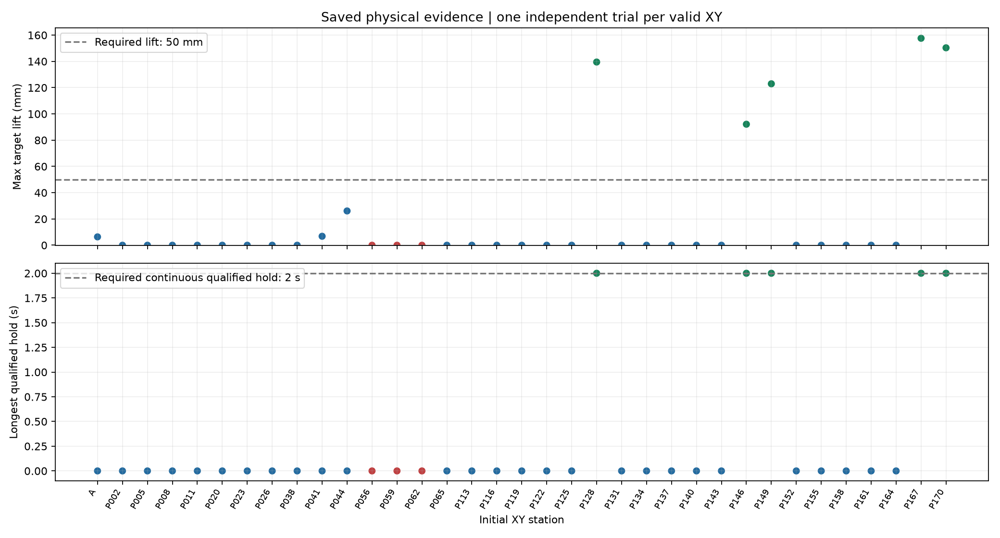

# v4 物理证据分析

## 放宽反馈停止条件后的实测结果

- 独立重放并校验完整证据摘要：**35 次**。本次成功判据为抓取接触／抬升／保持／滑移，轻微碰撞与躯干残差允许警告；不代表旧严格无碰撞协议通过。
- **27 次运行完整40秒**；终止原因：`{'horizon_exhausted_lift_contact_hold_or_slip': 27, 'severe_penetration': 3, 'strict_visual_mobile_pick': 5}`。躯干反馈残差和轻微碰撞不再成为停止原因。
- 曾有同一夹爪双指真实受力接触：**8 次**；目标曾抬升≥5cm：**5 次**；本批最大目标抬升 **157.601 mm**。
- 全部派发动作六关节映射已验证，最大派发联动误差 **0 rad**；反馈偏移仅警告，原始轨迹保留。
- v2／v3 的提前停止现象不能直接等同本次模型抓取结果。当前只对这些起点的一次真实执行下结论，不将一次失败解释为每点成功概率。
- 失败机制尚未通过对照干预定位；抓取接触、抬升及保持证据用于指出缺失的条件，而非证明某个模型／动力学原因。

图：每点来自4ms原始物理轨迹；抬升以该试验初始目标高度为基准。合格保持同时要求同夹爪双指受力、无支撑、抬升和滑移约束。蓝点为超时，红点为严重穿模停止，绿点为成功；虚线为验收阈值，无概率或误差棒。

[逐点证据指标](evidence_metrics.csv) · [独立轨迹重验收及摘要校验](evidence_revalidation.json)
