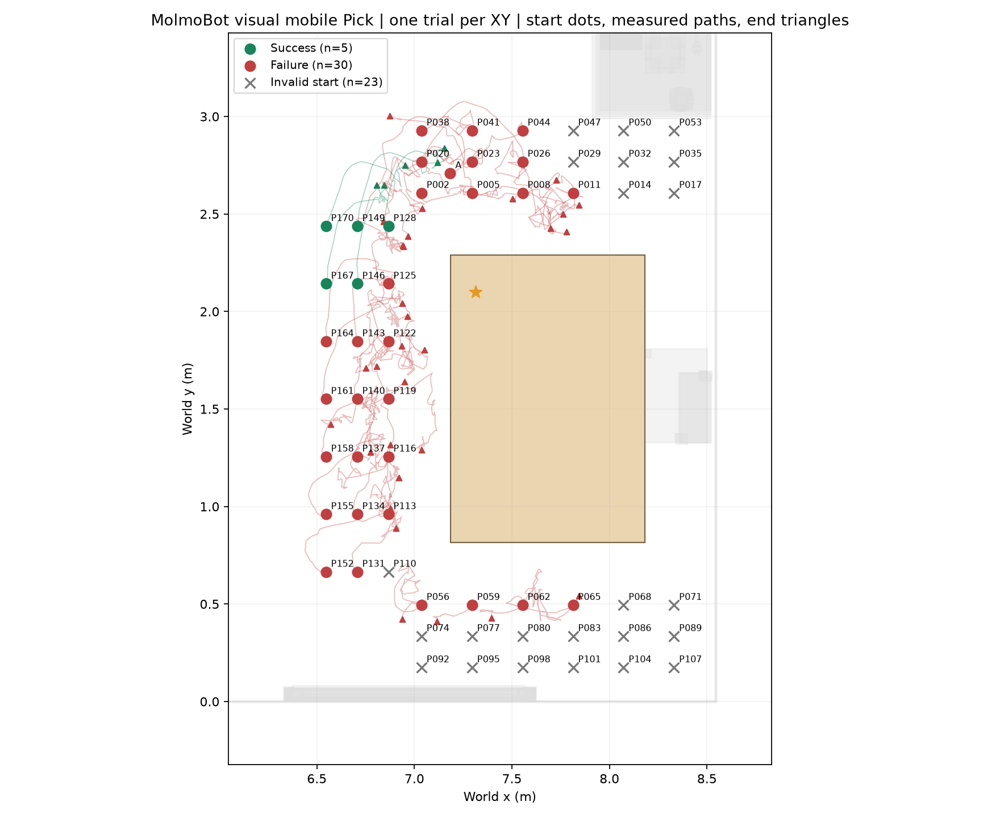
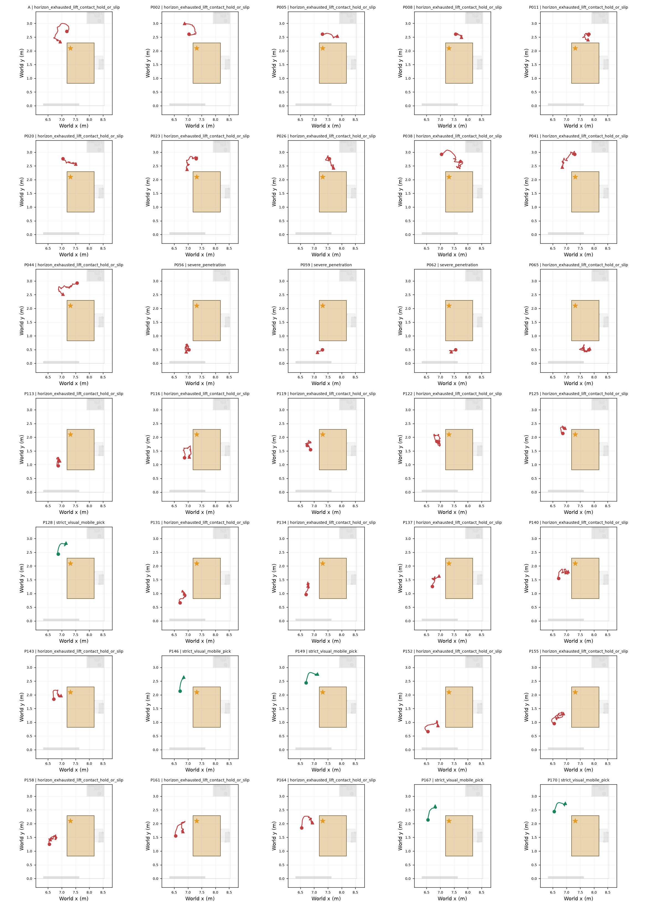

# Case1 MolmoBot 视觉移动抓取：molmobot_multitask_xy_v4

**运行状态：complete。58 个 XY 起点中，成功 5、物理失败 30、无效初始化 23、基础设施异常 0、未运行 0。**

每个有效起点单次试验；这不是每点成功概率，也不是固定底盘可抓取性。旧 case1 交付和人工门禁未修改。

[TOC]

## 执行设置与事先预期

- 本地 MolmoBot-RBY1Multitask，Pick 模式；右腕／头部／左腕 RGB 和22维本体状态，语言指令 `pick up the cup`。目标世界坐标、oracle 抓法和导航路径不输入策略。
- 完整20维动作，头部固定；10 Hz 策略，20 ms 控制周期，4 ms 物理采样；16步预测、8步执行，最多40秒。seed=0，动作限幅有原始输出与执行目标记录。
- 每次恢复原快照，仅改变底盘；A 保留原朝向，其余正对目标。碰撞初始化跳过；原抓取距离界外点不筛除。
- 预期覆盖58点、约35次有效试验；抓取结果事先未知。做成标准是完成有效视觉输入到真实控制和可重放物理验收的证据链，不是预设必须成功。
- 抓取成功仍要求同一夹爪双指真实受力、抬升≥5 cm、无支撑连续保持≥2 s、满足本次碰撞协议，头部固定、实际关节硬限位合规。
- 本次按用户授权采用躯干反馈告警协议：每步派发目标严格验证 `[0,h,-2h,h,0,0]` 且 h∈[0,0.738]；实际联动残差／范围偏移只警告，不结束 episode。此项与旧严格反馈协议不同，不能作等协议比较。
- 本次轻微碰撞仅警告并继续；任何机器人接触穿透深度达到 2.0 cm 时终止为 `severe_penetration`。该阈值是工程默认，不表示真实机器人安全保证；初始化碰撞筛除保持不变。
- 轻微碰撞告警试验 24，类别采样累计 16252，最大告警穿透 19.869 mm；每个接触对／深度／受力均有原始记录。
- 躯干反馈策略：`warn`；有警告试验 35，警告类别采样累计 163478，最大残差 0.072560 rad（原始4 ms轨迹可重算）。

## 起点结果与实际路线

图：观测单位为一个 XY 起点的单次试验。圆点为起点，三角为实测终点，叉为无效初始化；灰色障碍投影仅用于显示。没有误差棒，不把未运行或无效点填成失败。

图：各子图给出独立恢复后连续执行的实测底盘路线；不是规划路线。

## 逐点证据与旧 oracle（仅描述性并列）

| 起点 | VLA状态 | 原因 | 旧固定底盘相同位姿 | 视频 |
|---|---|---|---|---|
| A | executed_failure | horizon_exhausted_lift_contact_hold_or_slip | verified_success | [视频](../../../../cases/case1-cup-001/03_station_map/runs/molmobot_multitask_xy_v4/trials/A_attempt_000/rollout.mp4) |
| P002 | executed_failure | horizon_exhausted_lift_contact_hold_or_slip | 未实测该位姿 | [视频](../../../../cases/case1-cup-001/03_station_map/runs/molmobot_multitask_xy_v4/trials/P002_attempt_000/rollout.mp4) |
| P005 | executed_failure | horizon_exhausted_lift_contact_hold_or_slip | verified_success | [视频](../../../../cases/case1-cup-001/03_station_map/runs/molmobot_multitask_xy_v4/trials/P005_attempt_000/rollout.mp4) |
| P008 | executed_failure | horizon_exhausted_lift_contact_hold_or_slip | executed_failure | [视频](../../../../cases/case1-cup-001/03_station_map/runs/molmobot_multitask_xy_v4/trials/P008_attempt_000/rollout.mp4) |
| P011 | executed_failure | horizon_exhausted_lift_contact_hold_or_slip | 未实测该位姿 | [视频](../../../../cases/case1-cup-001/03_station_map/runs/molmobot_multitask_xy_v4/trials/P011_attempt_000/rollout.mp4) |
| P014 | invalid_initialization | initial_pose_collision | 未实测该位姿 | — |
| P017 | invalid_initialization | initial_pose_collision | 未实测该位姿 | — |
| P020 | executed_failure | horizon_exhausted_lift_contact_hold_or_slip | 未实测该位姿 | [视频](../../../../cases/case1-cup-001/03_station_map/runs/molmobot_multitask_xy_v4/trials/P020_attempt_000/rollout.mp4) |
| P023 | executed_failure | horizon_exhausted_lift_contact_hold_or_slip | 未实测该位姿 | [视频](../../../../cases/case1-cup-001/03_station_map/runs/molmobot_multitask_xy_v4/trials/P023_attempt_000/rollout.mp4) |
| P026 | executed_failure | horizon_exhausted_lift_contact_hold_or_slip | 未实测该位姿 | [视频](../../../../cases/case1-cup-001/03_station_map/runs/molmobot_multitask_xy_v4/trials/P026_attempt_000/rollout.mp4) |
| P029 | invalid_initialization | initial_pose_collision | 未实测该位姿 | — |
| P032 | invalid_initialization | initial_pose_collision | 未实测该位姿 | — |
| P035 | invalid_initialization | initial_pose_collision | 未实测该位姿 | — |
| P038 | executed_failure | horizon_exhausted_lift_contact_hold_or_slip | 未实测该位姿 | [视频](../../../../cases/case1-cup-001/03_station_map/runs/molmobot_multitask_xy_v4/trials/P038_attempt_000/rollout.mp4) |
| P041 | executed_failure | horizon_exhausted_lift_contact_hold_or_slip | 未实测该位姿 | [视频](../../../../cases/case1-cup-001/03_station_map/runs/molmobot_multitask_xy_v4/trials/P041_attempt_000/rollout.mp4) |
| P044 | executed_failure | horizon_exhausted_lift_contact_hold_or_slip | 未实测该位姿 | [视频](../../../../cases/case1-cup-001/03_station_map/runs/molmobot_multitask_xy_v4/trials/P044_attempt_000/rollout.mp4) |
| P047 | invalid_initialization | initial_pose_collision | 未实测该位姿 | — |
| P050 | invalid_initialization | initial_pose_collision | 未实测该位姿 | — |
| P053 | invalid_initialization | initial_pose_collision | 未实测该位姿 | — |
| P056 | executed_failure | severe_penetration | 未实测该位姿 | [视频](../../../../cases/case1-cup-001/03_station_map/runs/molmobot_multitask_xy_v4/trials/P056_attempt_000/rollout.mp4) |
| P059 | executed_failure | severe_penetration | 未实测该位姿 | [视频](../../../../cases/case1-cup-001/03_station_map/runs/molmobot_multitask_xy_v4/trials/P059_attempt_000/rollout.mp4) |
| P062 | executed_failure | severe_penetration | 未实测该位姿 | [视频](../../../../cases/case1-cup-001/03_station_map/runs/molmobot_multitask_xy_v4/trials/P062_attempt_000/rollout.mp4) |
| P065 | executed_failure | horizon_exhausted_lift_contact_hold_or_slip | 未实测该位姿 | [视频](../../../../cases/case1-cup-001/03_station_map/runs/molmobot_multitask_xy_v4/trials/P065_attempt_000/rollout.mp4) |
| P068 | invalid_initialization | initial_pose_collision | 未实测该位姿 | — |
| P071 | invalid_initialization | initial_pose_collision | 未实测该位姿 | — |
| P074 | invalid_initialization | initial_pose_collision | 未实测该位姿 | — |
| P077 | invalid_initialization | initial_pose_collision | 未实测该位姿 | — |
| P080 | invalid_initialization | initial_pose_collision | 未实测该位姿 | — |
| P083 | invalid_initialization | initial_pose_collision | 未实测该位姿 | — |
| P086 | invalid_initialization | initial_pose_collision | 未实测该位姿 | — |
| P089 | invalid_initialization | initial_pose_collision | 未实测该位姿 | — |
| P092 | invalid_initialization | initial_pose_collision | 未实测该位姿 | — |
| P095 | invalid_initialization | initial_pose_collision | 未实测该位姿 | — |
| P098 | invalid_initialization | initial_pose_collision | 未实测该位姿 | — |
| P101 | invalid_initialization | initial_pose_collision | 未实测该位姿 | — |
| P104 | invalid_initialization | initial_pose_collision | 未实测该位姿 | — |
| P107 | invalid_initialization | initial_pose_collision | 未实测该位姿 | — |
| P110 | invalid_initialization | initial_pose_collision | 未实测该位姿 | — |
| P113 | executed_failure | horizon_exhausted_lift_contact_hold_or_slip | 未实测该位姿 | [视频](../../../../cases/case1-cup-001/03_station_map/runs/molmobot_multitask_xy_v4/trials/P113_attempt_000/rollout.mp4) |
| P116 | executed_failure | horizon_exhausted_lift_contact_hold_or_slip | 未实测该位姿 | [视频](../../../../cases/case1-cup-001/03_station_map/runs/molmobot_multitask_xy_v4/trials/P116_attempt_000/rollout.mp4) |
| P119 | executed_failure | horizon_exhausted_lift_contact_hold_or_slip | 未实测该位姿 | [视频](../../../../cases/case1-cup-001/03_station_map/runs/molmobot_multitask_xy_v4/trials/P119_attempt_000/rollout.mp4) |
| P122 | executed_failure | horizon_exhausted_lift_contact_hold_or_slip | 未实测该位姿 | [视频](../../../../cases/case1-cup-001/03_station_map/runs/molmobot_multitask_xy_v4/trials/P122_attempt_000/rollout.mp4) |
| P125 | executed_failure | horizon_exhausted_lift_contact_hold_or_slip | verified_success | [视频](../../../../cases/case1-cup-001/03_station_map/runs/molmobot_multitask_xy_v4/trials/P125_attempt_000/rollout.mp4) |
| P128 | verified_success | strict_visual_mobile_pick | 未实测该位姿 | [视频](../../../../cases/case1-cup-001/03_station_map/runs/molmobot_multitask_xy_v4/trials/P128_attempt_000/rollout.mp4) |
| P131 | executed_failure | horizon_exhausted_lift_contact_hold_or_slip | 未实测该位姿 | [视频](../../../../cases/case1-cup-001/03_station_map/runs/molmobot_multitask_xy_v4/trials/P131_attempt_000/rollout.mp4) |
| P134 | executed_failure | horizon_exhausted_lift_contact_hold_or_slip | 未实测该位姿 | [视频](../../../../cases/case1-cup-001/03_station_map/runs/molmobot_multitask_xy_v4/trials/P134_attempt_000/rollout.mp4) |
| P137 | executed_failure | horizon_exhausted_lift_contact_hold_or_slip | 未实测该位姿 | [视频](../../../../cases/case1-cup-001/03_station_map/runs/molmobot_multitask_xy_v4/trials/P137_attempt_000/rollout.mp4) |
| P140 | executed_failure | horizon_exhausted_lift_contact_hold_or_slip | 未实测该位姿 | [视频](../../../../cases/case1-cup-001/03_station_map/runs/molmobot_multitask_xy_v4/trials/P140_attempt_000/rollout.mp4) |
| P143 | executed_failure | horizon_exhausted_lift_contact_hold_or_slip | 未实测该位姿 | [视频](../../../../cases/case1-cup-001/03_station_map/runs/molmobot_multitask_xy_v4/trials/P143_attempt_000/rollout.mp4) |
| P146 | verified_success | strict_visual_mobile_pick | 未实测该位姿 | [视频](../../../../cases/case1-cup-001/03_station_map/runs/molmobot_multitask_xy_v4/trials/P146_attempt_000/rollout.mp4) |
| P149 | verified_success | strict_visual_mobile_pick | 未实测该位姿 | [视频](../../../../cases/case1-cup-001/03_station_map/runs/molmobot_multitask_xy_v4/trials/P149_attempt_000/rollout.mp4) |
| P152 | executed_failure | horizon_exhausted_lift_contact_hold_or_slip | 未实测该位姿 | [视频](../../../../cases/case1-cup-001/03_station_map/runs/molmobot_multitask_xy_v4/trials/P152_attempt_000/rollout.mp4) |
| P155 | executed_failure | horizon_exhausted_lift_contact_hold_or_slip | 未实测该位姿 | [视频](../../../../cases/case1-cup-001/03_station_map/runs/molmobot_multitask_xy_v4/trials/P155_attempt_000/rollout.mp4) |
| P158 | executed_failure | horizon_exhausted_lift_contact_hold_or_slip | budget_exhausted_no_solution | [视频](../../../../cases/case1-cup-001/03_station_map/runs/molmobot_multitask_xy_v4/trials/P158_attempt_000/rollout.mp4) |
| P161 | executed_failure | horizon_exhausted_lift_contact_hold_or_slip | 未实测该位姿 | [视频](../../../../cases/case1-cup-001/03_station_map/runs/molmobot_multitask_xy_v4/trials/P161_attempt_000/rollout.mp4) |
| P164 | executed_failure | horizon_exhausted_lift_contact_hold_or_slip | 未实测该位姿 | [视频](../../../../cases/case1-cup-001/03_station_map/runs/molmobot_multitask_xy_v4/trials/P164_attempt_000/rollout.mp4) |
| P167 | verified_success | strict_visual_mobile_pick | 未实测该位姿 | [视频](../../../../cases/case1-cup-001/03_station_map/runs/molmobot_multitask_xy_v4/trials/P167_attempt_000/rollout.mp4) |
| P170 | verified_success | strict_visual_mobile_pick | 未实测该位姿 | [视频](../../../../cases/case1-cup-001/03_station_map/runs/molmobot_multitask_xy_v4/trials/P170_attempt_000/rollout.mp4) |

## 结果边界与下一步

- 物理失败原因计数：`{'horizon_exhausted_lift_contact_hold_or_slip': 27, 'severe_penetration': 3}`。这是事实分类，不是已验证的因果归因。
- baseline 是固定底盘、冻结 grasp 的 oracle，与本次允许移动且双臂可动的 VLA 不等条件；未做整体胜率或显著性比较。
- 每点只有一次且全部使用同一模型与seed，不做概率、独立样本或泛化声明。原始相机／模型输入、模型动作、限幅、物理接触和轨迹均可追溯。
- 无效初始化不支持判断模型能力；基础设施异常／未运行点不支持判断物理失败。若批次中断，修复公共接口后必须按冻结配置续跑；代码变化需新run。
- 尚未用对照干预验证失败机制；本次仅按用户明确授权更改躯干与轻微碰撞处理，抓取抬升和保持阈值未改变。下一步是否重复试验或更换协议，应另行决定。

## 证据与验证

- [冻结来源与配置](../../../../cases/case1-cup-001/03_station_map/runs/molmobot_multitask_xy_v4/frozen_inputs.json) · [VLA协议](../../../../cases/case1-cup-001/03_station_map/runs/molmobot_multitask_xy_v4/vla_protocol.json) · [逐点结果](../../../../cases/case1-cup-001/03_station_map/runs/molmobot_multitask_xy_v4/results.json) · [运行状态](../../../../cases/case1-cup-001/03_station_map/runs/molmobot_multitask_xy_v4/run_state.json)。
- 每个完成试验的 `audit.json` 从4 ms压缩原始轨迹重算结论；`evidence_manifest.json` 保存输入、动作、轨迹、视频与快照摘要。续跑检查摘要和重新验收。
- 保留：证据图PNG/SVG及复现脚本、紧凑CSV、冻结配置、动作和轨迹。权重只读引用；模型输入、快照、视频与完整日志不加入Git。
- 视觉规划：保留起点结果图和逐点实测路线图（证据类），不采用平滑概率热图或装饰性统计图。HTML使用同一Markdown生成，图片内嵌，可离线阅读。

<!-- evaluation-diagnostic -->
## 放宽反馈停止条件后的实测结果

- 独立重放并校验完整证据摘要：**35 次**。本次成功判据为抓取接触／抬升／保持／滑移，轻微碰撞与躯干残差允许警告；不代表旧严格无碰撞协议通过。
- **27 次运行完整40秒**；终止原因：`{'horizon_exhausted_lift_contact_hold_or_slip': 27, 'severe_penetration': 3, 'strict_visual_mobile_pick': 5}`。躯干反馈残差和轻微碰撞不再成为停止原因。
- 曾有同一夹爪双指真实受力接触：**8 次**；目标曾抬升≥5cm：**5 次**；本批最大目标抬升 **157.601 mm**。
- 全部派发动作六关节映射已验证，最大派发联动误差 **0 rad**；反馈偏移仅警告，原始轨迹保留。
- v2／v3 的提前停止现象不能直接等同本次模型抓取结果。当前只对这些起点的一次真实执行下结论，不将一次失败解释为每点成功概率。
- 失败机制尚未通过对照干预定位；抓取接触、抬升及保持证据用于指出缺失的条件，而非证明某个模型／动力学原因。

图：每点来自4ms原始物理轨迹；抬升以该试验初始目标高度为基准。合格保持同时要求同夹爪双指受力、无支撑、抬升和滑移约束。蓝点为超时，红点为严重穿模停止，绿点为成功；虚线为验收阈值，无概率或误差棒。

[逐点证据指标](evidence_metrics.csv) · [独立轨迹重验收及摘要校验](evidence_revalidation.json)
