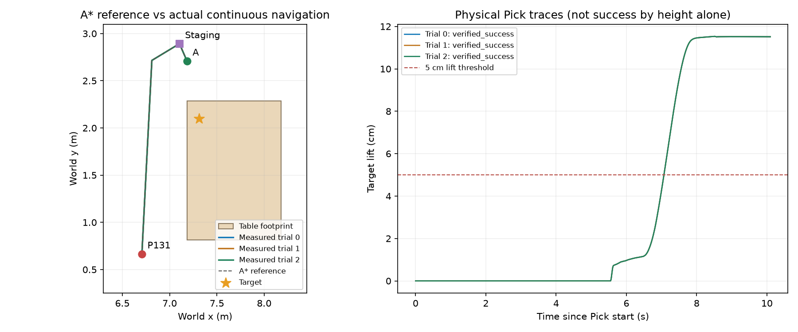

# Case 1-R 困难起点闭环执行总结

**已构建真实困难起点 P131，并完成 3 / 3 次新连续 MuJoCo 动态试验：A* 导航 → 实测到站无重置 → cuRobo 抓取，全部严格通过。人工最终接受尚未完成。**

## 过程与结果

1. 保留此前 original_only 筛除记录。按用户后续请求启用 robot_only 分支；“不改场景”是当时临时选择，不是永久限制。
2. 从步骤 3 的冻结站位图取超范围点，不用 agent 猜坐标。P056 未通过包含完整机器人外形的保守导航地图；最终选中 **P131**，保留完整筛选诊断。
3. 恢复同一源快照，仅改变初始底盘。非底盘 qpos 和全部 qvel 与源完全一致；杯子、家具、资产和碰撞未修改。P131 位于原批准的西侧操作带，桌边偏移 .48 m，head_camera 中目标实例可见 111 像素。
4. 用 A* 规划到安全停靠点，实际转向后接近已知成功 A 点。整个过程使用底盘位置伺服，不直接改执行中的 qpos；到站保留完整实测状态，再动态调整躯干并进行 cuRobo 规划与严格 Pick。
5. 独立复核三次完整原始导航、躯干调整和抓取轨迹；检查派生初始快照、实测到站快照、.004 s 连续采样及保存状态无时间回退。证据审计全部通过。

## 困难起点为何成立

- P131 base：`[6.706627596, 0.665376, 1.170331758]`，来自站位图，不是按目标固定距离截断导航。
- 到目标水平距离 **1.556593 m**，大于覆盖双臂、所有原地朝向、连续合法躯干的保守接触上界 **1.217127 m**，余量 **.339466 m**。
- 失败依据是 [保守接触范围证书](../cases/case1-cup-001/04_construct_start/runs/robot_move_v3/reach_certificate.json)，不是规划耗尽或伪造的伸臂失败动作。
- 不声称整条西侧不可操作或必须换到另一侧；西侧其他站位已有成功证据。当前证明的是 P131 原地不可操作，需要平移换站位。

## 真实重复结果

| 新试验 | 导航物理时间 | 总物理时间 | 最终抬升 | 严格判定 |
|---|---:|---:|---:|---|
| trial 0 / seed 0 | 210.84 s | 251.50 s | 11.51 cm | 通过 |
| trial 1 / seed 1 | 210.84 s | 251.50 s | 11.51 cm | 通过 |
| trial 2 / seed 2 | 210.84 s | 251.50 s | 11.51 cm | 通过 |

三次均检查双指真实正向承力、至少 .05 m 抬升、无支撑稳定保持至少 2 s，以及底盘、躯干、头、闲置臂和禁止碰撞约束。到站 base 与抓取前缀初始 base 完全一致，首个抓取调整 tick 距到站末 tick 为 .004 s。

图：虚线为 A* 参考，彩色线为三次实测结果；固定初始条件下轨迹和抬升曲线重合。三次重复不等于扰动鲁棒性或总体成功概率，抬升曲线也不能替代完整接触验收。

## 保留的失败与修复

- `robot_move_v1`：当前沙箱不可访问 EGL 设备，属于渲染基础设施失败，不能作为候选物理失败证据；改用已授权 CUDA 5 环境。
- `robot_move_v2 / astar_v1`：首试导航 23.12 s 附近，栅格拐点侧向冲击使躯干偏差超过 .002 rad，停止且未进入抓取，原始失败证据保留。
- `robot_move_v3 / astar_v2`：仅改执行策略：保守可见性简化路线、拐点减速停车再换向、降低线/角速度与加速度；P131、A、目标、家具和所有物理验收阈值不变，三次均通过。

## 交付与验证

- [闭环视频](../cases/case1-cup-001/05_closed_loop/runs/astar_v2/delivery/case1_r_closed_loop.mp4) · [第二张证据审阅卡](../cases/case1-cup-001/05_closed_loop/runs/astar_v2/delivery/review.html)
- [三次结果](../cases/case1-cup-001/05_closed_loop/runs/astar_v2/summary.json) · [原始证据复核](../cases/case1-cup-001/05_closed_loop/runs/astar_v2/evidence_audit.json)
- [派生构造配置](../cases/case1-cup-001/04_construct_start/runs/robot_move_v3/case_config.json) · [人工方式记录](../cases/case1-cup-001/04_construct_start/runs/robot_move_v3/human_choice.json)
- [视频溯源](../cases/case1-cup-001/05_closed_loop/runs/astar_v2/delivery/video_manifest.json) · [单元测试](unit-tests.log)

视频是 trial 0 的真实保存状态回放，无生成或插值运动。导航 8×、躯干调整 4×、起点和抓取 1×，逐段标注；墙体只在渲染中剖切，物理碰撞始终保留。交付视频为 **45.96 s、1280×720、25 fps**。81 项单元测试通过，见 [交付校验记录](step5-delivery-validation.json)。证据图和起点/保持预览已实际查看，最终编码视频已完成全片解码、帧数/时长校验及抽帧查看；不声称浏览器截图验收。

当前已完成所选构造的物理闭环和重复验收，没有自动人工批准或导出最终数据集。后续目标/家具修改可新开构造分支并单独记录、重新验收；步骤 6 仍等待人工介入。
